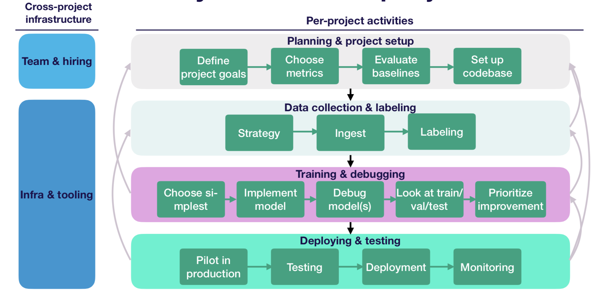

# ml_project_template

## Life cycle of a Machine Learning Project



## Machine Learning Tools


## Deployment Monitor


# Tutorial
(I will update tutorial video later)

## Our choices
### Data
- Data Labeling: DataTurks
- Data Storage: s3, file system, SQL, (data lake)
- Data Versioning: s3 + json, DVC
- Data Workflow: Airflow (TODO)

### Development
- Software Engineering: python, jupyter, git
- Resource Management: docker, kubernetes
- Framework: pytorch
- Experiment Management: tensorboard
- Distributed Training: AWS/GCP
- Hyperparameter Optimization: (...)

### Deployment
- CI/Testing: Circle CI, Jenkins, linting
  - https://jenkins.io/doc/tutorials/build-a-multibranch-pipeline-project/
- Web: AWS Lambda Serverless / Docker, Pytorch Serving
- Interchange: ONNX
- Monitoring: could be monitored in AWS
- Hardware/Mobile: CoreML, MLKit


# Resource
- https://fullstackdeeplearning.com/
- https://github.com/alirezadir/Production-Level-Deep-Learning

# Install
`apt update`
- Docker
```
curl -fsSL https://get.docker.com -o get-docker.sh
sh get-docker.sh
```
`apt install docker-compose`
- Python
```
apt install python3.6
apt install python3-pip
```

### How to run web on local to develop?
```
cd web
npm install 
npm run build
npm run start
```

### Tools use in this template
1. Flask
2. Redis
3. ReactJS
4. Nginx
5. Certbot
6. Celery
7. Docker
8. Jenkins (optional)